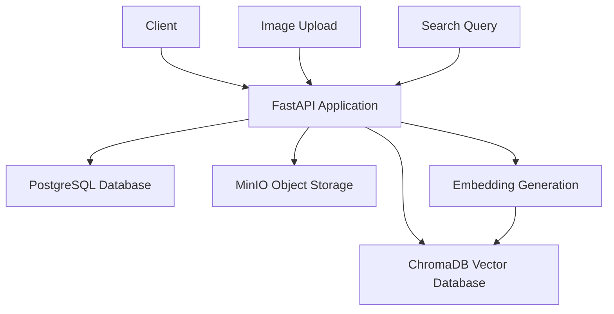

```markdown
# Image Management API

<div align="center">


[](https://fastapi.tiangolo.com/)
[](https://www.docker.com/)
[](https://www.python.org/)
[](LICENSE)

**A scalable image management service with semantic search capabilities**

</div>

---

## 🌟 Overview

The Image Management API provides a robust solution for organizations to store, organize, and intelligently search their image collections. Leveraging vector embeddings and semantic understanding, it goes beyond traditional keyword-based search to allow natural language queries and similarity matching.

<div align="center">
  <table>
    <tr>
      <td align="center">🔒<br><b>Secure Access</b></td>
      <td align="center">🔍<br><b>Semantic Search</b></td>
      <td align="center">📊<br><b>Visual Analytics</b></td>
      <td align="center">🔌<br><b>API-First Design</b></td>
    </tr>
  </table>
</div>

## 🚨 **IMPORTANT NOTICE** 🚨

<div align="center">

### **FULL DOCUMENTATION AVAILABLE AT [http://localhost:8080/documentation](http://localhost:8080/documentation)**

</div>

---

## 📋 Prerequisites

Before running this application, ensure you have:

```
✅ Docker (version 20.10 or newer)
✅ Docker Compose (version 2.0 or newer)
✅ 4GB+ of available RAM
✅ 10GB+ of available disk space
```

## 🚀 Quick Start Guide

### 1. Clone the repository

```bash
git clone https://github.com/yourusername/image-management-api.git
cd image-management-api
```

### 2. Create necessary directories

```bash
mkdir -p data/chroma_db
```

### 3. Start the services

```bash
docker-compose up -d
```

<details>
<summary>This command starts the following services:</summary>

- **FastAPI application** (main service)
- **PostgreSQL database** (metadata storage)
- **MinIO** (S3-compatible object storage)
- **ChromaDB** (vector database for embeddings)

</details>

### 4. Verify the application is running

```bash
curl http://localhost:8080
```

Expected output:
```json
{
  "message": "Welcome to Image Management API. Visit /docs for API documentation."
}
```

### 5. Create test data (optional)

```bash
curl http://localhost:8080/debug/create-test-data
```

<details>
<summary>Example response:</summary>

```json
{
  "message": "Test data created successfully",
  "team_id": "550e8400-e29b-41d4-a716-446655440000",
  "user_id": "7c9273c5-e8d5-4f8f-9c3a-3c6b3b94f8c2",
  "api_key": "imapi_demo_key_for_testing_purposes_only"
}
```

</details>

---

## 🔗 Available Endpoints

<div align="center">

| Endpoint | Description | 
|:---------|:------------|
| [`/docs`](http://localhost:8080/docs) | Swagger UI API Documentation |
| [`/redoc`](http://localhost:8080/redoc) | ReDoc API Documentation |
| [`/openapi.json`](http://localhost:8080/openapi.json) | OpenAPI Specification |
| [`/`](http://localhost:8080/) | Root Endpoint |
| [`/system-check`](http://localhost:8080/system-check) | System Health Check |
| [`/debug/database`](http://localhost:8080/debug/database) | Database Debug Information |
| [`/debug/create-test-data`](http://localhost:8080/debug/create-test-data) | Create Test Data |
| [`/debug/vector-status`](http://localhost:8080/debug/vector-status) | Vector Database Status |
| [`/vector-ui`](http://localhost:8080/vector-ui) | Vector UI |
| [`/static`](http://localhost:8080/static) | Static Files |
| [`/documentation`](http://localhost:8080/documentation) | Main Documentation |
| [`/app-web`](http://localhost:8080/app-web) | Web Application Interface |

</div>

---

## 💻 Web Application Interface

<div align="center">


</div>

A prototype web interface is available at [http://localhost:8080/app-web](http://localhost:8080/app-web). This interface provides:

- User-friendly image management dashboard
- Visual search capabilities
- Collection organization tools
- Vector embedding visualizations

> ⚠️ **Note**: This interface is still under development and not all features may be fully functional.

---

## 📁 MinIO Storage Interface

You can access the MinIO storage interface to manage your stored files directly:

```
🔗 URL: http://localhost:9000
👤 Username: minio
🔑 Password: minio123
```

<div align="center">
  


</div>

---

## 🏗️ Architecture



The application consists of several components:

1. **FastAPI Application**: Main service that handles HTTP requests
2. **PostgreSQL Database**: Stores metadata, user information, and relationships
3. **MinIO**: S3-compatible object storage for image files
4. **ChromaDB**: Vector database for storing and querying image embeddings

---

## 📘 API Usage Examples

### Authentication

Most endpoints require authentication. You can use the API key generated by the test data creation:

```bash
curl -H "X-API-Key: imapi_demo_key_for_testing_purposes_only" \
     http://localhost:8080/api/v1/users/me
```

### Uploading an Image

```bash
curl -X POST \
  http://localhost:8080/api/v1/images/upload \
  -H "X-API-Key: imapi_demo_key_for_testing_purposes_only" \
  -F "file=@/path/to/your/image.jpg" \
  -F "description=Sample image"
```

### Searching for Images

```bash
curl -X POST \
  http://localhost:8080/api/v1/search/text \
  -H "X-API-Key: imapi_demo_key_for_testing_purposes_only" \
  -H "Content-Type: application/json" \
  -d '{"query": "sunset over mountains", "limit": 10}'
```

---

## 🔧 Troubleshooting

<details>
<summary><b>Services not starting</b></summary>

Check if ports 8080, 5432, and 9000 are already in use on your system:

```bash
# Check port usage
sudo lsof -i :8080
sudo lsof -i :5432
sudo lsof -i :9000
```

</details>

<details>
<summary><b>Database connection issues</b></summary>

Check the logs:

```bash
docker-compose logs db
docker-compose logs app
```

Common issue: The PostgreSQL service might need more time to initialize before the application connects.

</details>

<details>
<summary><b>MinIO connection issues</b></summary>

```bash
docker-compose logs minio
```

Verify MinIO configuration in docker-compose.yml matches the environment variables set in the application.

</details>

### Rebuilding the Application

If you make changes to the code or need to rebuild the application:

```bash
docker-compose down
docker-compose build
docker-compose up -d
```

---

## ⚙️ Environment Variables

The main configuration is done through environment variables defined in the docker-compose.yml file:

```yaml
environment:
  # Database Configuration
  - DATABASE_URL=postgresql+asyncpg://postgres:postgres@db:5432/image_api
  
  # Storage Configuration
  - GCS_BUCKET_NAME=image-management-api-local
  - MINIO_ENDPOINT=http://minio:9000
  - MINIO_ACCESS_KEY=minio
  - MINIO_SECRET_KEY=minio123
  - USE_MINIO=true
  
  # Vector Database Configuration
  - CHROMA_PERSIST_DIRECTORY=/app/data/chroma_db
  - CHROMA_COLLECTION_NAME=image_embeddings
  
  # Embedding Model Configuration
  - EMBEDDING_MODEL=clip
  - EMBEDDING_DIMENSION=512
  - ENABLE_REAL_EMBEDDINGS=false
  
  # Search Configuration
  - SEARCH_CACHE_EXPIRY=3600
  - SEARCH_RESULT_LIMIT=100
```

---

## 📝 License

This project is licensed under the MIT License - see the LICENSE file for details.

<div align="center">
  
  <p>Built with ❤️ by the Image Management API Team</p>
  
  <a href="https://github.com/yourusername/image-management-api/issues">Report Bug</a>
  ·
  <a href="https://github.com/yourusername/image-management-api/issues">Request Feature</a>
  
</div>
```